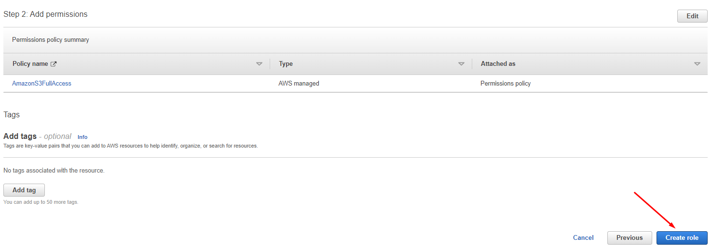
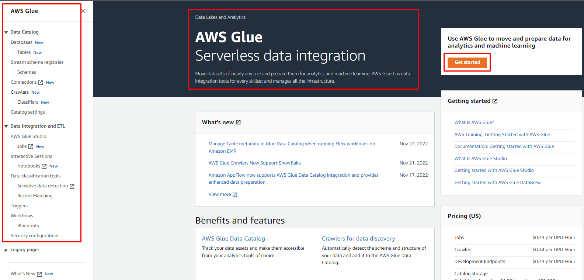
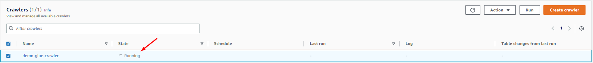
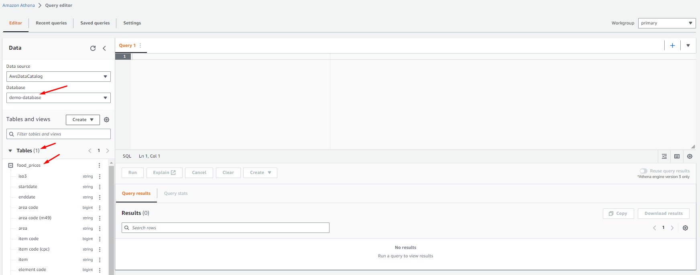

# AWS Athena Glue Querying S3 Bucket Data Through AWSConsole

## Description
AWS Athena, Glue Database, Glue Crawler and S3 buckets deployment through AWS GUI console.

## Overview
AWS Athena - Serverless interactive query service works with S3 using standard SQL, you only pay for querying the data
AWS Glue Crawler - fully managed extract, transform, and load ETL service, runs on S3, creates metadata tables, and that table in the AWS Glue Data Catalog and can be used in Athena to search, and query available data.

### Part - 1
----
Login to your AWS Console and go to "IAM"
Click on "Roles" from the left-side panel and click on the "Create role" button on the right-side panel.

Select "AWS Services" and in "Use cases for other AWS services:" search for Glue and select "Glue", click the "Next" button

In "Add permissions" search for AWSGlueConsoleFullAccess, S3FullAccess, and CloudWatchLogs, select "AWSGlueConsoleFullAccess", "AmazonS3FullAccess", "CloudWatchLogsFullAccess" and click on the "Next" button

Give name to that role and description as "AWSGlueS3Role" and click "Create role" button

### Part - 2
----
Now go to "Amazon S3" from your AWS console and select "Buckets" from the left panel, click on the "Create bucket" button from the right panel.

Insert a unique bucket name and select your region

Rest default settings and click on "Create bucket" button

Click on your created bucket to create folder and upload .csv data file

Insert folder name and click on "Create Folder" button

Click on created folder to upload your data file

Upload your data file or folder also there you will find your bucket destination URL

### Part - 3
----
Now from AWS console go to service "AWS Glue" to create Crawler

Click on "Crawlers" from left side panel and "Create crawler" button from right side panel

Give name, description and click on "Next" button

If your data source already exists select otherwise "Not yet" and add your data source with the "Add a data source" button

Select S3 from the drop-down menu and give the S3 path, you can also browse the path. Select subsequent crawler runs also if you want to exclude any files you can select and add a pattern and the "Add an S3 data source" button

After adding data source click "Next" button

Select your IAM role that we created in our first step otherwise you can create new IAM role and click "Next" button

Now you have to add a database for output configuration, click on "Add database" button

In browser new tab will open to create database, fill the details and create database

In the crawler, tab refreshes your database and select created database in "Frequency" select as you want to run your crawler on demand, daily, weekly, monthly, etc, and the "Next" button.

Review and click "Create crawler" button

Select your crawler and click the "Run" button to create a metadata table so it'll take some time to create a metadata table.

After successfull completion, crawler create the metadata table

Meanwhile, you can go to the CloudWatch console, select "Log groups" from the left side panel and check the logs of your Glue Crawler.

### Part - 4
----
Now as crawling is done, you have to go to Athena console and select "Query editor" from the left side panel

In query editor under "Data" select your database that you created in creation of glue crawler

After selecting the database, it'll show the metadata table that created the crawler in "Tables"

Click on three dots besides table and click on "Preview Table" to run query, you can also create your own query in "Query 1" panel

After running your first query, it's through error because there's no query output source define in your S3 bucket to save your query results

To resolve issue go to your S3 bucket console and create a "athena-output" folder there

Copy the path from folder properties

Now back in Athena console, in Query editor select "Settings" tab and click on "Manage" button

Add your S3 bucket athena output path and save

In Query editor click on "Run again" button to run the query so finally you'll get the results

After your all testing you can clean up the resources to avoid any extra charges from AWS, thanks.
